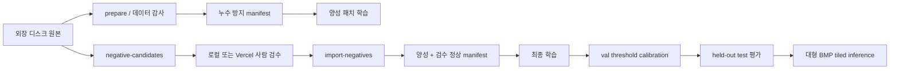

# 프로젝트 구조와 아키텍처

## 목표

대형 터널 스캔 BMP 또는 패치 이미지를 입력받아 다음 결과를 생성합니다.

1. 픽셀 단위 균열 확률과 이진 마스크
2. 원본 위에 균열 위치를 표시한 overlay
3. 후처리된 균열 픽셀과 연결요소를 이용한 이미지 단위 균열 유무

현재 구현은 학습, 평가, 임계값 보정, 대형 이미지 tiled inference까지 포함합니다.
Vercel 앱은 GPU 추론 서비스가 아니라 정상 후보를 사람이 검수하기 위한 도구입니다.

## 전체 흐름



## 모델

- 현재 기준 체크포인트: `openmmlab/upernet-swin-tiny`
- 지원 구조: UPerNet + Swin backbone, SegFormer
- 검증한 대안 체크포인트:
  - `nvidia/segformer-b1-finetuned-ade-512-512`
  - `nvidia/segformer-b2-finetuned-ade-512-512`
- 클래스: `background=0`, `crack=1`
- 기본 학습/추론 입력: 512×512
- 체크포인트 형식: Hugging Face config + `model.safetensors`

`src/ourbrain_cv/modeling.py`가 모델 생성과 체크포인트 로드를 담당합니다.
새 모델은 config의 `model.architecture`로 명시하며 저장된 Hugging Face 디렉터리는
config에서 구조를 다시 판별할 수 있습니다. UPerNet을 MPS에서 실행할 때 일부
adaptive pooling이 지원되지 않는 문제는 작은 feature map만 CPU로 보내는 호환
계층으로 처리합니다.

## 코드 모듈

| 모듈 | 책임 |
|---|---|
| `manifest.py` | 이미지·마스크 페어 감사, group split, manifest 생성 |
| `data.py` | 이미지·마스크 로드, 안전한 background/crack-centered crop |
| `transforms.py` | 이미지와 마스크에 동일한 공간 변환 적용 |
| `modeling.py` | UPerNet/SegFormer 로드, UPerNet MPS 호환, 체크포인트 복원 |
| `losses.py` | focal, Dice, Tversky, clDice, boundary loss |
| `training.py` | 학습 loop, freeze/unfreeze, scheduler, early stopping, 저장 |
| `metrics.py` | pixel confusion, Dice/IoU, boundary F1, 이미지 단위 지표 |
| `evaluation.py` | split 평가와 validation threshold calibration |
| `tiling.py` | 겹치는 타일과 blend window 생성 |
| `inference.py` | 대형 이미지 추론, 확률·마스크·overlay·요약 저장 |
| `postprocessing.py` | 작은 연결요소 제거 |
| `negative_candidates.py` | 원본 BMP에서 정상 후보 추출 |
| `review_ui.py` | 로컬 키보드 검수 UI |
| `remote_review.py` | 인증된 Vercel 검수 번들, 상태, CSV 다운로드 |
| `reviews.py` | 검수 결과 검증, 감사 파일 확인, manifest 반영 |
| `image_io.py` | 대형 24-bit BMP의 필요한 행만 안전하게 읽기 |
| `cli.py` | `ourbrain-cv` 명령 진입점과 품질 게이트 |

## 주요 CLI

```text
prepare
negative-candidates
review-ui
import-negatives
train
calibrate
evaluate
infer
remote-review-bundle
remote-review-status
remote-review-download
```

명령별 옵션은 다음과 같이 확인합니다.

```bash
uv run ourbrain-cv <command> --help
```

## 데이터 누수 방지

파일명 첫 prefix에서 `group_id`를 만들고 그룹 단위로 split합니다. 동일 터널 원본에서
파생된 인접 패치가 서로 다른 split에 들어가면 validation/test 점수가 과대평가될 수
있으므로, 패치 단위 무작위 분할은 사용하지 않습니다.

현재 group split은 다음과 같습니다.

| split | 그룹 | 양성 패치 |
|---|---:|---:|
| train | 62 | 774 |
| validation | 13 | 221 |
| test | 14 | 228 |

그룹 중복은 0개입니다.

## 임계값과 추론 일관성

`calibrate`는 validation의 이미지 단위 recall 하한을 만족하는 후보 중 이미지 단위
specificity가 가장 높은 임계값을 선택합니다. 동률이면 crack Dice와 높은 임계값을
차례로 사용합니다.

보정 JSON에는 체크포인트와 manifest의 SHA-256, 후처리 설정이 기록됩니다.
`evaluate`와 `infer`는 다른 체크포인트나 다른 후처리 설정에 보정 결과를 재사용하는
것을 거부합니다.

대형 이미지 추론은 다음 절차를 사용합니다.

1. 512×512 겹침 타일 생성
2. Hann 계열 blend weight로 경계 이음 완화
3. 전체 확률맵 결합
4. 고정 임계값 적용
5. 작은 연결요소 제거
6. 마스크, overlay, JSON 요약 저장

양성 비율이 `maximum_positive_ratio`를 넘으면 보정되지 않은 모델의 폭주로 간주해
연결요소 분석과 자동 균열 유무 결정을 보류합니다.

## 저장 경계

- 원본 이미지와 장비 외 백업: 외장하드 `E:\`
- 코드·설정·테스트·문서·웹 코드: Git 저장소
- Windows 기준 프로젝트: `D:\ourbrain\`
- 실행용 데이터: `D:\ourbrain-data\`
- 보존 체크포인트: `D:\ourbrain\checkpoints\`
- Windows CUDA 실행 결과: `D:\ourbrain\runs\`
- Mac 로컬 생성물: `build/`, `outputs/`
- 비밀값: `.env.remote-review.local` 및 배포 환경변수

원본 이미지, 접근 토큰과 모델 대용량 산출물은 Git에 커밋하지 않습니다.
